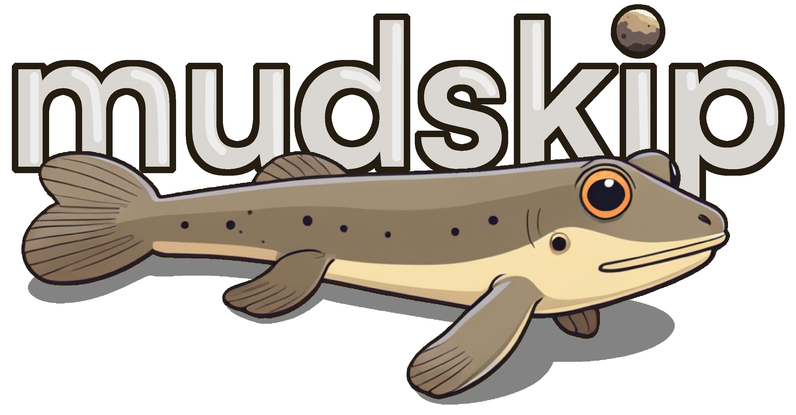

<!-- PROJECT LOGO -->
 

  

<h1 align="center"><a href="https://github.com/tambercore/hottnat">Mudskip</a> for <a href="https://wiki.portal.chalmers.se/agda/pmwiki.php">Agda</a></h1>

  

    Automatically transform Natural Language into <a href="https://wiki.portal.chalmers.se/agda/pmwiki.php">Agda</a> with <a href="https://github.com/tambercore/hottnat">Mudskip</a> provides a complete symbolic derivation   from Natural Language Statements to Agda, using Lambeq, CCG, λ-Calculus, and Dependent Type Theory.
     
     
    <a href="https://wiki.portal.chalmers.se/agda/pmwiki.php">Try it Out</a>
    ·
    <a href="https://wiki.portal.chalmers.se/agda/pmwiki.php">Learn Agda</a>
    ·
    <a href="https://github.com//tobybenjaminclark/divinity/issues">Report Bug</a>
    ·
    <a href="https://github.com/tobybenjaminclark/divinity/issues">Request Feature</a>
  

## What is [Mudskip](https://github.com/tambercore/hottnat)?
Mudskip is a symbolic theorem prover designed to reason with Natural Langauge statements and built on top of Agda. 
- Easily translate, and formalise natural language statements into a dependent-type theory.
- Prove properties between natural langauge statements, i.e. entailment & contradiction.
- Visualise and understand step-by-step derivations on our dedicated web compiler.