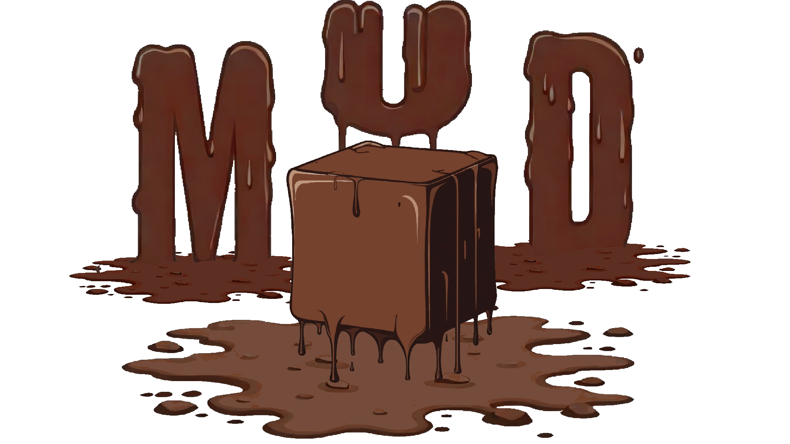

<!-- PROJECT LOGO -->
 

  

<h1 align="center"><a href="https://github.com/tambercore/mud">Mud Theorem Prover</a></h1>

  

    Automatically transform Natural Language into <a href="https://wiki.portal.chalmers.se/agda/pmwiki.php">Agda</a> with <a href="https://github.com/tambercore/mud">Mud</a> provides a complete symbolic derivation   from Natural Language Statements to Agda, using Lambeq, CCG, λ-Calculus, and Dependent Type Theory.
     
     
    <a href="https://wiki.portal.chalmers.se/agda/pmwiki.php">Try it Out</a>
    ·
    <a href="https://wiki.portal.chalmers.se/agda/pmwiki.php">Learn Agda</a>
    ·
    <a href="https://github.com//tobybenjaminclark/divinity/issues">Report Bug</a>
    ·
    <a href="https://github.com/tobybenjaminclark/divinity/issues">Request Feature</a>
  

### What is [Mud Theorem Prover](https://github.com/tambercore/mud)?
Mud is a symbolic theorem prover designed to reason with Natural Langauge statements through the derivation of dependent types, expressed in _Agda_. This work is inspired by research led by Aarne Ranta, Robin Cooper and aims to provide an automated, end-to-end type-theoretic implementation of natural language reasoning.
- Easily translate, and formalise natural language statements into a dependent-type theory.
- Prove properties between natural langauge statements, i.e. entailment & contradiction.
- Visualise and understand step-by-step derivations on our dedicated web compiler.

### How does [Mud Theorem Prover](https://github.com/tambercore/mud) work?
Each _lexeme_ (word) in a natural language statement is assigned a part-of-speech tag, e.g. _verb_, _noun_, _adverb_. Then, syntactic-categories are derived and the sentence is reduced as a tree like structure to a base type S (Sentence), these categories include bi-directional functor types that when applied can reduce the sentence. From here, we map rules in the CCG to type-theoretic derivations (similar to Montague's Universal Grammar), and compile to Agda. For more information on the details of how this works, please refer to our paper.
1. Words are tagged using a [Brill Tagger](https://en.wikipedia.org/wiki/Brill_tagger), a transformational system.
2. CCG is generated, each word maps to a _syntactic type_.
3. Functors in the CCG are converted to λ-Calculus, with types being inferred.
4. Code is generated to [Agda](https://wiki.portal.chalmers.se/agda/pmwiki.php)
### Contributors
Mud Theorem Prover is designed, and developed by [Amber Swarbrick](https://github.com/aswarbs/) and [Toby Clark](https://github.com/tobybenjaminclark/) in a joint-disseration for masters in Computer Science under the supervision of [Professor. Thorsten Altenkirch](https://en.wikipedia.org/wiki/Thorsten_Altenkirch) at [University of Nottingham](https://www.nottingham.ac.uk/). If you're interested in contributing, have a question or are interested, please get in touch!
